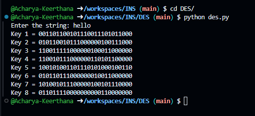

# DES Key Generation Implementation in Python

## Overview
This Python script implements a custom DES-like key generation process using binary operations, bit manipulation, and random obfuscation. The algorithm takes an input string, converts it into a binary representation, removes specific bits, applies bitwise shifts, and generates a set of keys with obfuscation for potential use in DES encryption.

## Features
- Converts a string to its binary representation.
- Removes every 8th bit from the binary string.
- Splits the modified binary string into left and right halves.
- Performs bitwise left shifts on both halves using predefined shift values.
- Combines the shifted binary strings to form preliminary keys.
- Applies random obfuscation to generate the final keys.
- Outputs 8 unique keys.

## How It Works
1. **Convert the Input to Binary:**  
   Each character of the input string is converted into its 8-bit binary representation.

2. **Remove Specific Bits:**  
   Every 8th bit of the resulting binary string is removed to modify the data before further processing.

3. **Split the Binary String:**  
   The modified binary string is split into two equal halves, referred to as `left` and `right`.

4. **Apply Bitwise Shifts:**  
   A predefined list of shift values (`[2, 3, 6, 7, 1, 6, 5, 9]`) is used to perform left bit-shifts on both halves.

5. **Key Generation and Obfuscation:**  
   - For each shift value, the script:
     - Converts the left and right halves to integers.
     - Performs a left bit-shift by the specified shift value.
     - Converts the results back to binary strings.
     - Combines portions of these shifted strings to form a preliminary key.
   - Randomly selects 8 unique indices and removes the bits at those positions to obfuscate the key.
   - Stores the final key in a list.

6. **Output:**  
   The script prints all 8 generated keys.

## Prerequisites
- Python 3.x installed

## Usage
1. Run the script in a Python environment.
2. Enter a string when prompted.
3. The script will generate and display 8 obfuscated keys based on your input.

## Example

## Online Demo
You can run this code directly via [OnlineGDB](https://onlinegdb.com/-7MCUUv2_)

