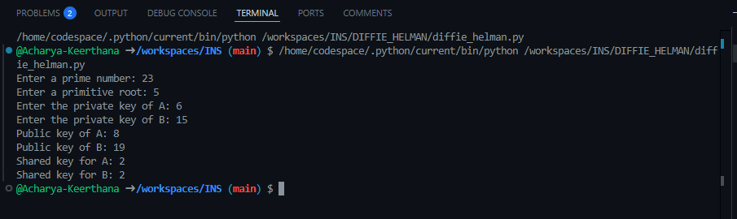

# **Diffie-Hellman Key Exchange**  

## **Introduction**  
This script demonstrates the **Diffie-Hellman Key Exchange Algorithm**, which allows two parties to securely generate a shared secret over an insecure channel. The protocol is widely used in cryptographic applications for secure communications.  

## **Features**  
- Generates a shared secret key without direct transmission of the key itself.  
- Uses modular exponentiation for secure key exchange.  
- Prevents eavesdroppers from deriving the secret key even if public keys are intercepted.  

## **How It Works**  
1. **Prime Number and Primitive Root Selection:**  
   - A prime number **q** and a primitive root **a** are chosen.  
2. **Private Key Selection:**  
   - Two users (A and B) each select private keys **Xa** and **Xb**, respectively.  
3. **Public Key Computation:**  
   - Public keys are calculated using modular exponentiation:  
     \[ Y = a^X \mod q \]  
4. **Key Exchange and Shared Secret Computation:**  
   - Each user computes the shared secret key using the other user’s public key:  
     \[ K = Y^X \mod q \]  
5. **Secure Communication Established:**  
   - Both computed shared keys are identical, ensuring a secure key agreement.  

## **Usage**  
### **Running the Script**  
1. Ensure Python is installed on your system.  
2. Copy the script into a Python file (e.g., `diffie_hellman.py`).  
3. Run the script:  
   ```bash  
   python3 diffie_hellman.py  
   ```  
4. Enter the required inputs when prompted.  
5. The public keys and shared secret keys will be displayed.  

### **Example**  
#### **Input:**  
```
Enter a prime number: 23  
Enter a primitive root: 5  
Enter the private key of A: 6  
Enter the private key of B: 15  
```
#### **Output:**  
```
Public key of A: 8  
Public key of B: 19  
Shared key for A: 2  
Shared key for B: 2  
```


## **Online Demo**  
You can run this code directly via [OnlineGDB](https://onlinegdb.com/kEdQg40tL).  


