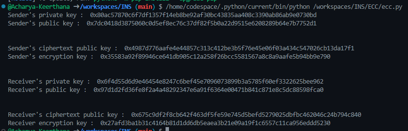

# **Elliptic Curve Cryptography (ECC) Key Exchange**  

## **Introduction**  
This script demonstrates **Elliptic Curve Cryptography (ECC) Key Exchange**, a public-key encryption technique that provides security equivalent to traditional cryptosystems but with shorter key lengths. ECC is widely used in secure communications, digital signatures, and cryptographic key exchange.  

## **Features**  
- Utilizes **brainpoolP256r1**, a widely recognized elliptic curve.  
- Generates sender and receiver private-public key pairs.  
- Computes a shared encryption key securely.  
- Uses point compression to minimize key storage size.  

## **How It Works**  
1. **Initialize the Elliptic Curve:**  
   - The script loads the `brainpoolP256r1` curve from the `tinyec` library.  
2. **Key Generation:**  
   - Both sender and receiver generate private keys using a secure random function.  
   - Public keys are derived by multiplying the private key with the curve generator point.  
3. **Encryption Key Computation:**  
   - A random **cipher private key** is generated.  
   - The corresponding **cipher public key** is computed.  
   - A shared encryption key is derived by multiplying the cipher public key with the private key.  
4. **Output:**  
   - The sender and receiver's private keys, public keys, ciphertext public keys, and encryption keys are displayed.  

## **Usage**  
### **Running the Script**  
1. Install the required Python library:  
   ```bash  
   pip install tinyec  
   ```  
2. Copy the script into a Python file (e.g., `ecc_key_exchange.py`).  
3. Run the script:  
   ```bash  
   python3 ecc_key_exchange.py  
   ```  
4. The generated keys and encryption keys will be displayed.  

### **Example Output:**  




## **Online Demo**  
You can run this code directly via [OnlineGDB](https://onlinegdb.com/w5B3ftwSZS).  

