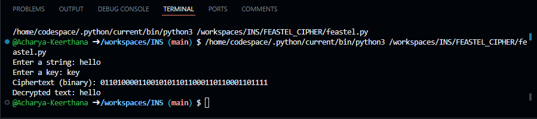

# Feistel Cipher Implementation in Python

## Overview
This Python script implements a basic Feistel-like encryption and decryption process using binary operations. The algorithm takes an input string and a key, then performs two rounds of Feistel transformations to produce an encrypted binary output.

## Features
- Converts a string to its binary representation.
- Implements a two-round Feistel encryption/decryption process.
- Converts the encrypted binary back into a readable string.

## How It Works
1. Convert the input string to binary.
2. Split the binary string into left and right halves.
3. Convert the key into binary.
4. Perform two rounds of Feistel transformation:
   - Apply a simple function using addition and XOR with the key.
   - Swap the halves between rounds.
5. Generate and output the encrypted binary string.
6. Convert the binary output back to text.

## Prerequisites
- Python 3.x installed

## Usage
1. Run the script in a Python environment.
2. Enter a string as the plaintext input.
3. Enter a key (string) for encryption.
4. The script outputs:
   - The encrypted binary representation.
   - The decrypted text (which may not always match the original text exactly due to binary transformations).

## Example

## Online demo
you can run this code directly via. https://onlinegdb.com/YaJrNDHxV

