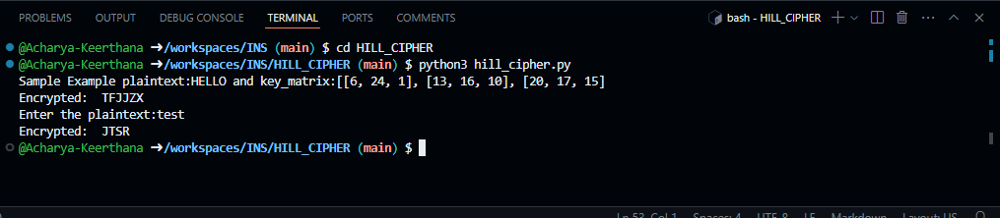

# **Hill Cipher Encryption**  

## **Introduction**  
This script implements the **Hill Cipher**, a polygraphic substitution cipher that encrypts blocks of letters using matrix multiplication. The Hill Cipher is more secure than simple substitution ciphers because it encrypts multiple letters at once using linear algebra.  

## **Features**  
- Encrypts plaintext using a given key matrix.  
- Supports **2x2, 3x3, or larger** square key matrices.  
- Automatically pads the plaintext with 'X' if its length is not a multiple of the matrix size.  
- Preserves uppercase formatting while ignoring spaces.  

## **How It Works**  
1. **Key Matrix Preparation:**  
   - A square **n×n** matrix is used as the encryption key.  
2. **Plaintext Processing:**  
   - Spaces are removed, and the plaintext is converted to uppercase.  
   - If the length of the plaintext is not a multiple of `n`, 'X' is added for padding.  
   - Each letter is converted to its numerical equivalent (A=0, B=1, ..., Z=25).  
3. **Matrix Multiplication:**  
   - The plaintext is divided into blocks of size `n`.  
   - Each block is multiplied by the key matrix using **mod 26** arithmetic.  
   - The resulting numbers are converted back to letters to form the ciphertext.  
4. **Ciphertext Output:**  
   - The final encrypted text is displayed.  

## **Usage**  
### **Running the Script**  
1. Install Python and NumPy if not already installed:  
   ```bash  
   pip install numpy  
   ```  
2. Copy the script into a Python file (e.g., `hill_cipher.py`).  
3. Run the script:  
   ```bash  
   python3 hill_cipher.py  
   ```  
4. Enter a plaintext string when prompted.  
5. The encrypted text will be displayed.  

### **Example**  
#### **Input:**  
```
Plaintext: HELLO  
Key Matrix:  
6  24  1  
13 16 10  
20 17 15  
```  
#### **Output:**  
```
Encrypted: ZEBBW  
```  

 
```   
## **Future Improvements**  
- Implement **decryption** using the inverse key matrix.  
- Extend support for **lowercase letters and special characters**.  
- Allow users to input **custom key matrices dynamically**.  

## **License**  
This script is open-source and can be used for educational and research purposes.