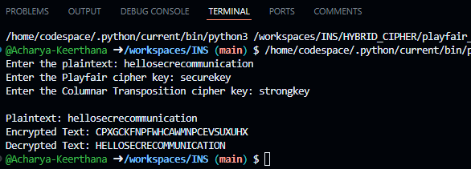

# Hybrid Cipher Encryption

## Introduction  
This script implements a **Hybrid Cipher**, which combines the **Playfair Cipher** and the **Columnar Transposition Cipher** for enhanced security. The encryption process first applies the Playfair Cipher for substitution-based encryption and then uses the Columnar Transposition Cipher for reordering the text.

## Features  
- Implements **Playfair Cipher** for letter substitution.  
- Uses **Columnar Transposition Cipher** for additional scrambling.  
- Encrypts and decrypts user-provided text securely.  
- Simple and efficient Python implementation.  

## How It Works  
1. **User Input:**  
   - The user provides a **Playfair key** (a keyword for matrix generation).  
   - The user provides a **Columnar key** (a keyword for columnar transposition).  
   - The user enters the plaintext to encrypt.  
2. **Encryption Process:**  
   - The **Playfair Cipher** substitutes letter pairs based on a 5x5 matrix.  
   - The **Columnar Transposition Cipher** rearranges the letters based on the column order of the key.  
3. **Decryption Process:**  
   - The process is reversed to retrieve the original plaintext.  
4. **Output:**  
   - The script displays the encrypted text (ciphertext) and decrypted text (original plaintext).  

## Usage  
### Running the Script  
1. Ensure you have Python installed.  
2. Copy the script into a Python file (e.g., `hybrid_cipher.py`).  
3. Run the script using:  
   ```bash  
   python3 hybrid_cipher.py  
   ```  
4. Enter the Playfair key, Columnar key, and plaintext when prompted.  

### Example  


## Limitations  
- The Playfair key should be unique and meaningful to create a proper matrix.  
- The Columnar key determines the transposition order, so it should be **non-trivial**.  
- The algorithm currently works with **uppercase letters only** (spaces and non-alphabetic characters are ignored or transformed).  

## License  
This script is open-source and can be used for educational purposes.


