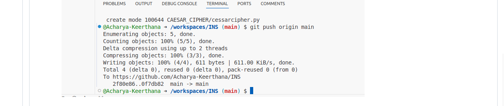

<<<<<<< HEAD:CAESAR_CIPHER/README.md
# Caesar Cipher Encryption  

## Introduction  
This script implements the **Caesar Cipher** encryption and decryption algorithm in Python. The **Caesar Cipher** is a simple shift cipher that replaces each letter in the plaintext with another letter a fixed number of positions down the alphabet.  

## Features  
- Encrypts both uppercase and lowercase letters.  
- Maintains non-alphabetic characters (spaces, punctuation, numbers) unchanged.  
- Supports user-defined shift values (key).  

## How It Works  
1. **Input Handling:**  
   - The user enters the plaintext and a numeric key (shift value).  
2. **Character Shifting:**  
   - Each letter is shifted forward by the key value.  
   - If the shift moves past 'Z' or 'z', it wraps around to the start of the alphabet.  
   - Uppercase and lowercase letters are handled separately.  
3. **Non-Letter Handling:**  
   - Non-alphabetic characters remain unchanged.  
4. **Output:**  
   - The encrypted ciphertext is displayed.  

## Usage  
### Running the Script  
1. Ensure Python is installed on your system.  
2. Copy the script into a Python file (e.g., `caesar_cipher.py`).  
3. Run the script using:  
   ```bash  
   python caesar_cipher.py  
   ```  
4. Enter the plaintext and key when prompted.  

 

 

## License  
This script is open-source and can be used for educational purposes.
=======
# Monoalphabetic Cipher Encryption  

## Introduction  
This script implements a **Monoalphabetic Cipher**, a type of substitution cipher where each letter in the plaintext is replaced with a corresponding letter from a user-defined replacement alphabet. This provides more security than the **Caesar Cipher** since each letter has a unique mapping instead of a fixed shift.  

## Features  
- Allows the user to define a custom 26-letter replacement alphabet.  
- Encrypts lowercase letters while keeping non-alphabetic characters unchanged.  
- Simple and efficient implementation for basic encryption.  

## How It Works  
1. **User Input:**  
   - The user provides a 26-character replacement alphabet (unique and in lowercase).  
   - The user enters the plaintext string to encrypt.  
2. **Letter Substitution:**  
   - Each letter in the plaintext is replaced based on its index in the original alphabet.  
   - Non-alphabetic characters remain unchanged.  
3. **Output:**  
   - The encrypted text (ciphertext) is displayed.  

## Usage  
### Running the Script  
1. Ensure you have Python installed.  
2. Copy the script into a Python file (e.g., `monoalphabetic_cipher.py`).  
3. Run the script using:  
   ```bash  
   python monoalphabetic_cipher.py  
   ```  
4. Enter the replacement alphabet and plaintext when prompted.  

### Example  
#### Input:  
```
Enter the replacement alphabet (26 unique letters): qwertyuiopasdfghjklzxcvbnm  
Enter the string you want to encrypt: hello  
```  
#### Output:  
```
Ciphertext: itssg  
```  


## License  
This script is open-source and can be used for educational purposes.
>>>>>>> 8a2b5a5 (inital commit):MONOALPHABETIC CIPHER/README.md
