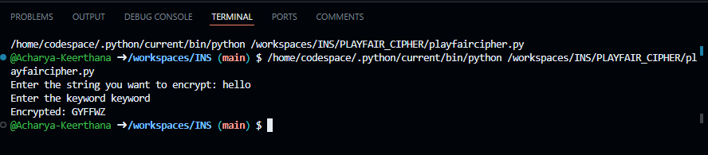

# Playfair Cipher Encryption  

## Introduction  
This script implements the Playfair Cipher encryption algorithm in Python. The Playfair Cipher is a digraph substitution cipher that encrypts pairs of letters based on a 5x5 matrix generated from a given keyword.  

## Features  
- Generates a Playfair cipher matrix from a given key.  
- Encrypts a given plaintext message by applying Playfair Cipher rules.  
- Handles duplicate letters and odd-length plaintext by adding padding.  

## How It Works  
1. **Matrix Creation:** A 5x5 matrix is created using the provided key. The key's unique characters are added first, followed by the remaining letters of the alphabet (excluding 'J', which is replaced with 'I').  
2. **Plaintext Preparation:** The plaintext is converted to uppercase, spaces are removed, and 'J' is replaced with 'I'. If the length is odd, 'X' is appended as padding.  
3. **Encryption Rules:**  
   - If both letters of a pair are in the same row, they are replaced with the next letter in the row.  
   - If both letters are in the same column, they are replaced with the next letter in the column.  
   - Otherwise, each letter is replaced by the letter in the same row but in the other letter’s column.  

## Usage  
### Running the Script  
1. Ensure you have Python installed.  
2. Copy the script into a Python file (e.g., `playfair.py`).  
3. Modify the `plaintext` and `key` variables with your input.  
4. Run the script using:  
   ```bash  
   python3 playfair.py  
   ```  
5. The encrypted text will be displayed in the output.  


 
```
## License  
This script is open-source and can be modified or used for educational purposes.
