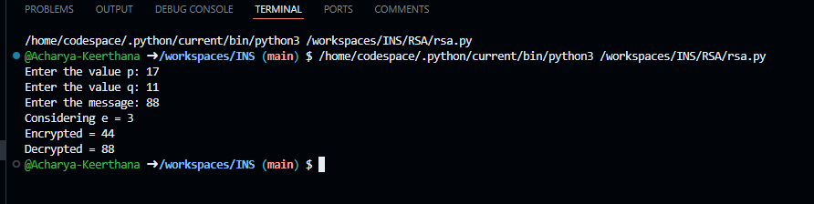

# RSA Encryption and Decryption Implementation in Python

## Overview
This Python script implements a basic RSA encryption and decryption process using prime numbers, public and private key generation, and modular exponentiation. The algorithm takes two prime numbers (p and q) and a message (m) as input, computes the modulus \( n \) and Euler's totient function \( \phi \), selects a public exponent \( e \) that is coprime with \( \phi \), and determines the corresponding private exponent \( d \). The script then encrypts the message using the public key and decrypts it using the private key.

## Features
- **Key Generation:** Dynamically generates RSA keys using user-provided prime numbers.
- **Encryption:** Encrypts a numerical message using the RSA public key.
- **Decryption:** Decrypts the ciphertext back to the original message using the RSA private key.
- **Educational Implementation:** Designed for learning purposes and demonstrates the core concepts of RSA.

## How It Works
1. **Input:**  
   The user is prompted to enter two prime numbers (p and q) and a message (m) to be encrypted.
   
2. **Key Generation:**  
   - **Compute \( n \):** \( n = p \times q \)
   - **Compute \( \phi \):** \( \phi = (p - 1) \times (q - 1) \)
   - **Select \( e \):** The script iterates from 2 to \( \phi - 1 \) to find the first integer \( e \) that is coprime with \( \phi \) (i.e., \( \text{gcd}(e, \phi) = 1 \)).
   - **Compute \( d \):** The script finds \( d \) such that \( (d \times e) \mod \phi = 1 \).

3. **Encryption:**  
   The message \( m \) is encrypted using the formula:
   \[
   c = m^e \mod n
   \]
   where \( c \) is the ciphertext.

4. **Decryption:**  
   The ciphertext \( c \) is decrypted using the formula:
   \[
   \text{decrypted message} = c^d \mod n
   \]
   The decrypted message should match the original message \( m \).

5. **Output:**  
   The script displays the chosen public exponent \( e \), the encrypted message, and the decrypted message.

## Prerequisites
- Python 3.x installed

## Usage
1. **Run the Script:**  
   Execute the script in your Python environment:
   ```bash
   python3 rsa.py
   ```
2. **Input Values:**  
   - Enter a prime number for \( p \).
   - Enter a prime number for \( q \).
   - Enter the message \( m \) (as an integer) to be encrypted.
3. **View Output:**  
   The script will print:
   - The chosen public exponent \( e \).
   - The encrypted message.
   - The decrypted message.

## Example




## Online Demo
You can run this code directly via [OnlineGDB](https://onlinegdb.com/dehaPA5z8).

## Disclaimer
This implementation of RSA is for educational purposes only. It uses a simplified key generation approach and is not intended for secure encryption in production environments. For robust cryptographic applications, use well-established libraries and follow current security best practices.

