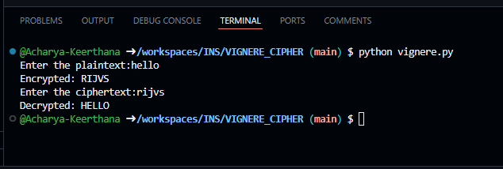

# Vigenère Cipher Implementation in Python

## Overview

This Python script provides simple functions to encrypt and decrypt text using the Vigenère cipher. The cipher uses a repeating key to shift each letter of the plaintext by a value corresponding to the letter in the key. The process is case-insensitive and non-alphabetical characters remain unchanged.

## Features

- **Encryption:** Converts plaintext into ciphertext using the Vigenère cipher.
- **Decryption:** Reverses the encryption to retrieve the original text.
- **Case Handling:** Processes input in a case-insensitive manner.
- **Non-Alphabet Handling:** Leaves non-alphabet characters unchanged.

## How It Works

1. **Encryption:**
   - Convert the key and plaintext to uppercase.
   - For each alphabetical character in the plaintext, calculate a shift based on the corresponding character in the key.
   - Shift the plaintext character by the calculated shift value and add it to the ciphertext.
   - For non-alphabetical characters, directly append them to the ciphertext.

2. **Decryption:**
   - Convert the key and ciphertext to uppercase.
   - For each alphabetical character in the ciphertext, calculate the shift using the corresponding key character.
   - Reverse the shift to retrieve the original plaintext character.
   - Non-alphabet characters are directly appended to the plaintext.

## Prerequisites

- Python 3.x

## Usage

1. **Clone or Download the Script:**
   - Save the provided code into a Python file (e.g., `vigenere.py`).

2. **Run the Script:**
   - Execute the script using Python:
     ```bash
     python3 vigenere.py
     ```

3. **Follow the Prompts:**
   - The script will first ask for plaintext input to encrypt using the hard-coded key `"KEY"`.
   - Then, it will prompt for ciphertext input to decrypt using the same key.

## Example


## Online Demo

You can run this code directly online via [Replit](https://replit.com/languages/python3).


